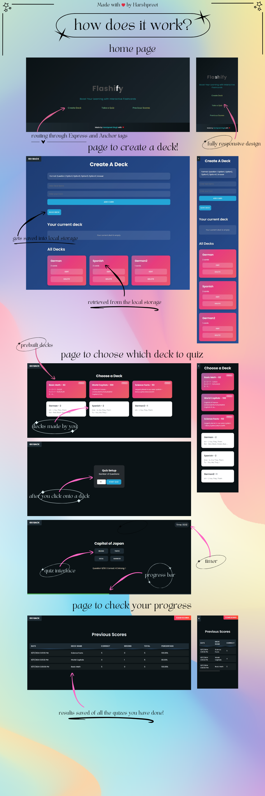

## Boost Your Learning with Interactive Flashcards!

Flashify is a fully responsive web-based application designed to enhance your learning experience through interactive flashcards. Whether you're studying for exams, learning a new language, or simply expanding your knowledge, Flashify provides an engaging platform to create, manage, and quiz yourself with customized flashcard decks.

## Features

- **Create Custom Decks**: Easily create and manage your own flashcard decks.
- **Take Quizzes**: Test your knowledge with interactive quizzes from your created decks or pre-built ones.
- **Track Progress**: View your previous scores and monitor your improvement over time.
- **Responsive Design**: Enjoy a seamless experience across desktop and mobile devices.

## Getting Started

### Prerequisites

- Node.js
- npm

### Installation

1. Clone the repository:
   ```
   git clone https://github.com/harshpreet931/Flashify.git
   ```

2. Navigate to the project directory:
   ```
   cd Flashify
   ```

3. Install dependencies:
   ```
   npm install
   ```

4. Start the server:
   ```
   npm start
   ```

5. Open your browser and visit `http://localhost:3000` to start using Flashify.

**Note**: If you are facing any issues in npm start.. there may be something running on your portnumber :3000, in order to fix that change the port number in server.js

## Usage


### Creating a Deck

1. Click on "Create Deck" from the home page.
2. Enter a unique deck name.
3. Add cards to your deck by entering the exact format mentioned in the page.
4. Click "Save Deck" when you're finished.

### Taking a Quiz

1. Click on "Take a Quiz" from the home page.
2. Select a deck from the available options.
3. Choose the number of questions for your quiz.
4. Start the quiz and answer the questions.
5. View your results at the end of the quiz.

### Viewing Previous Scores

1. Click on "Previous Scores" from the home page.
2. Review your past quiz performances, including date, deck name, and score percentages.

## Project Structure

- `public/`: Contains all static files (HTML, CSS, client-side JS)
- `server.js`: Express server setup and routing
- `createDeck.js`: Handles deck creation functionality
- `quiz.js`: Manages quiz logic and user interactions
- `previousScores.js`: Displays and manages user's quiz history

## Technologies Used

- HTML5
- CSS3
- JavaScript (ES6+)
- Node.js
- Express.js
- LocalStorage for client-side data persistence

## Hosting with Vercel
Flashify is hosted on Vercel, providing fast and reliable access to the application. You can access the live version at https://flashify-quiz.vercel.app.

## Contact

Harshpreet Singh - [LinkedIn](https://www.linkedin.com/in/harshpreet931/)

Project Link: [https://github.com/harshpreet931/Flashify](https://github.com/harshpreet931/Flashify)

---

Made with ❤️ by Harshpreet Singh